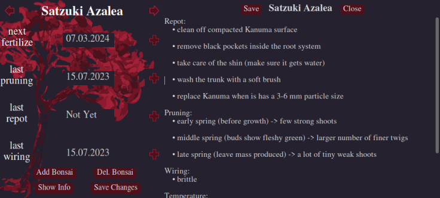

<!-- PROJECT LOGO -->
 

  

  <h3 align="center">Bonsai Notification App</h3>

  

    This small GUI manages the dates of typical bonsai maintenance actions and displays some basic infos.
     
    The app is compiled for Linux using pyinstaller and can be found in <a href="https://github.com/viktor-pfaffenrot/bonsai-notifier/blob/main/dist/bonsai_notifier_Linux/">here</a>. 
    Please download the entire folder 'bonsai_notifier_Linux'.
     
    <a href="https://raw.githack.com/viktor-pfaffenrot/bonsai-notifier/main/docs/_build/html/bonsai_notifier.html"><strong>Documentation</strong></a>
     
     
  

  

Requires python>=3.8 for the non-compiled code. Tested on Ubuntu 20.04.

